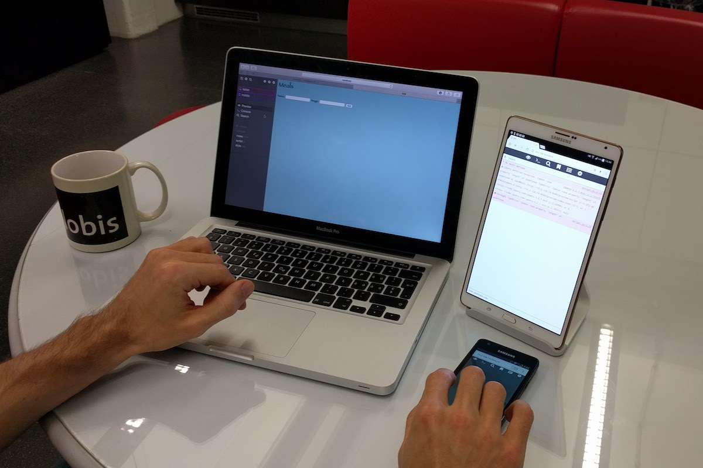
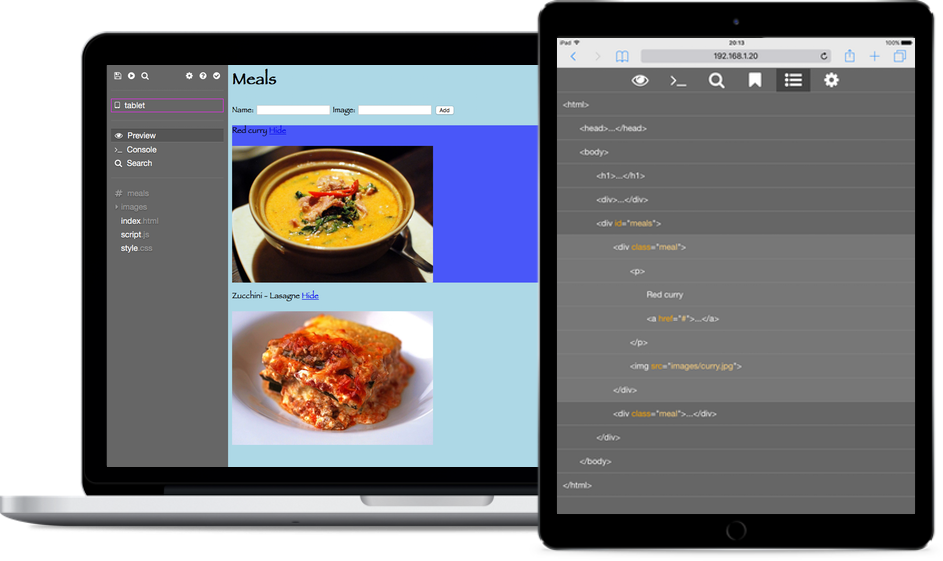

# XDE

A cross-device IDE that runs in the browser.

XDE has been created to support developers who often work away from the traditional office desk, for example while traveling between home, work, or a client's site, or in other public places like a cafe. With XDE, many devices can be connected together to provide more screen real estate. Due to its cross-device nature, XDE also allows testing and debugging mobile web applications from a personal computer.

- Collaboratively edit HTML, CSS and JavaScript files
- Embedded preview of HTML files
- JavaScript console connected to the preview
- Global search and replace
- Remote DOM inspection



## Install with NPM

```
npm install https://github.com/nickasd/xde
```

## Usage

XDE consists of two components: the server and the client code.

The server is responsible for hosting the user project and coordinating the requests from the clients. It can be run on Windows, macOS and Linux. The minimum system requirements are:

- [Node.js](https://nodejs.org) 9.4.0
- npm 6.2.0 (automatically installed along Node.js)

The clients run the frontend in a browser by connecting to the server. The browser must support ES6. The following ones have been tested: Chrome 72.0, Safari 12.0.3 and Safari 10.0 Mobile.

The server is started as follows:

```
cd xde
npm start projectdir
```

`projectdir` is the path to a project directory to be loaded and made available to the clients (you may use the `example` directory for a demo). When the server has started up, a list of internet addresses is output for the clients to connect to. The address for clients on the same machine as the server will be `http://localhost:8080`. It is not recommended to run multiple clients in the same browser due to storage conflicts, but you can use different browsers on the same machine.

The clients simply enter one of the addresses given by the server in the address bar and they are ready to go.



## Build

If you want to contribute to XDE, you can run the command

````
cd xde
npm run dev projectdir
```

to start the server and automatically restart it when you modify one of the files inside the `server` directory, and the command

```
cd xde
npm run browserify
````

to build the client Javascript and automatically rebuild it when you modify the script `client/index.js` or one of its required files.
